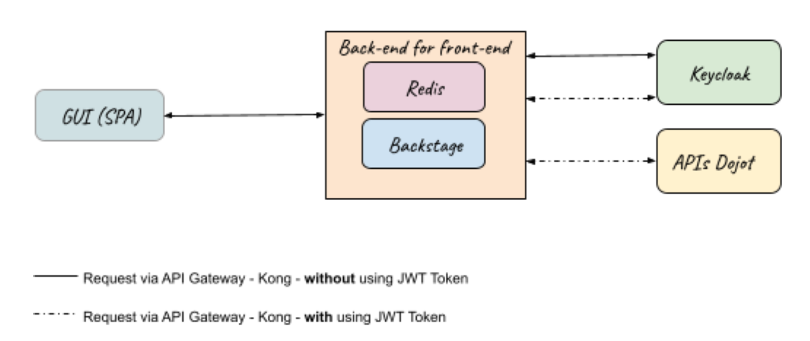
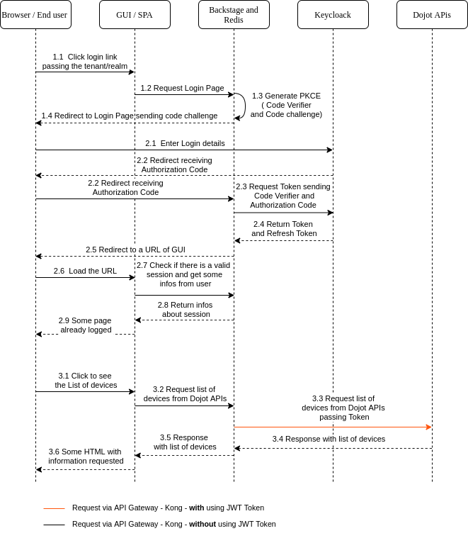

# Backstage

The **Backstage** is intended to be an intermediary between the dojot and Keycloak APIs for the GUIs.

## **Table of Contents**

- [Overview](#overview)
  - [Mapping between Backstage and dojot devices](#reading-data-from-backstage)
- [Dependencies](#dependencies)
  - [Dojot Services](#dojot-services)
  - [Others Services](#others-services)
- [Running the service](#running-the-service)
  - [Configurations](#configurations)
    - [General Configurations](#general-configurations)
    - [Server Configurations](#server-configurations)
    - [Backstage Configurations](#backstage-configurations)
    - [Service State Manager](#service-state-manager)
  - [How to run](#how-to-run)
- [Documentation](#documentation)
- [Issues and help](#issues-and-help)

## Overview

## Keycloak

Keycloak implements the OAuth 2.0 and OpenID Connect processes, has its own customizable login screen and a tenant in the dojot is equivalent to a `realm` in Keycloak.

The Backstage will use the Keycloak to execute the Open ID connect flow. In order to obtain greater security, the proposal is that the JWT token and the Refresh Token are accessible only in Backstage and kept in Redis. Another important point is that to identify the session between the browser and the backstage, an HttpOnly cookie will be used, and in that cookie there will be a session identification.

The main idea is that the backstage also controls control the time of the active session, obtain new JWT tokens from the Refresh Token, make available information about permissions associated with the user and information about the user (login, email, name). When it comes to active session management, the idea is to have an active session with a maximum of `session.redis.max.life.time.sec` and a maximum idle of `session.redis.max.idle.time.sec`. Whenever a new request is made the maximum idle time is restarted, if this time passes without there being a request the user will have to make a new login, as well as if maximum active session time ends.

### Requirements

- Have a public client registered in the Keycloak the value can be set in `keycloak.public.client.id`
- If you are using kong with the dojot plugin, pepkong, when registering resources/endpoints in Kong, define which ones are safe, they need authentication and authorization (a valid token and permission to access). Whenever a request is made passing through Kong in one of these resources that need authentication and authorization, a plugin is executed in Kong that checks in the Keycloack if the token in the header can access the resource/endpoint that it is intending to access, in case it cannot return an error.

### Architecture

The architecture of the integration of the Keycloak with the GUIs (SPAs) is shown in Figure 1, it is important to note that dojot APIs comprise all the features/APIs available in the dojot that require authorization using Token and that the data received from the APIs of dojot by Backstage can be processed before being sent to GUIs.



### Main flows

The sequence diagram (figure 2) shows the main flows and below the figure are explained point by point the diagram.



1. Flow of obtaining login screen
   1. User clicks on login and the GUI receives the click;
   1. The GUI makes a GET request for the `<app.base.url>/backstage/v1/auth?tenant=<tenant>&state=<state>` endpoint in the backstage;
   1. The backstage creates a session cookie; generates the code verifier and code challenge pair; creates a record in Redis to save session data with the prefix key `session.redis.key.prefix.name.max.life` and suffix session identifier, for example `session:abcde`; this register has valid for `session.redis.max.life.time.sec`, ttl;  another record is also created with prefix key `session.redis.key.prefix.name.max.idle` and suffix session identifier, for example `session-idle:abcde` with`session.redis.max.login.return.time.sec` as validity, ttl and this record has no data; See also Common/continuous streams for 1 and 3. TODO
   1. It's returns a redirect to the login screen with code 303 for <base-url>/realms/<tenant>/protocol/openid-connect/auth?client_id=gui&redirect_uri=<base-url>/backstage/v1/auth/return&state=<state-1>&response_type=code&scope=openid&code_challenge=<code-challenge>&code_challenge_method=<code-challenge-method>
2. Login data sending flow
   1. The user places his login and password, and sends it to the keycloak. If they are valid, the keycloak continues the flow and redirects to the URL via GET defined in redirect_uri, in the case <base-url>/backstage/v1/auth/return,passing the Authorization Code and State in the QueryString of the URL.
   1. The Backstage <base-url>/backstage/v1/auth/ return endpoint receives the Authorization Code. (As much as the request is made for the backend, the return happens in the browser and the authorization code is exposed, which is not a problem since we have the pkce verification in the backend).
   1. The Backstage makes a request to the keycloak to obtain the Token and Refresh Token via POST with content-type of type 'application/x-www-form-urlencoded' for URL <url-interna-kong>/auth/realms/<tenant>/protocol/openid-connect/token passing in the request body grant_type=authorization_code & redirect_uri=<redirect-uri> & client_id=gui & code_verifier=<code-verifier>&code=<authorization-code>.
   1. If the backstage flow works, that is, the Backstage is able to receive the Token and the Refresh Token, the Backstage redirects with the code 303 to <uri-gui-return>?state=<state-1>.
   1. The redirected URL is called in the Browser
   1. The page is requested for the GUI
   1. The GUI checks if there is a valid session, to do so, it makes a request via GET to <base-url>/backstage/v1/auth/user-info
   1. The backstage returns 200 with the user's data such as name, email and their permissions. At this point, Backstage makes 2 requests for the keycloak using the Token to obtain user information and permissions.
   1. The page is loaded with information from the logged in user.
   - Alternative to 2.4: if you are unable to obtain the Tokens
      - Deletes the redis session
      - The user is redirected to <url-gui-retorno> and a message is sent in QueryString saying that there was a problem, the GUI handles the message.

   - Alternative to 2.8: if you can't get data from the active session
      - The session is deleted and returns 401
3. An example Flow of obtaining data from dojot APIs
   1. The user already logged in makes a request to see the list of devices registered in his tenant, for some URL of the type `<base-url>/backstage/v1/devices`.
   1. Backstage receives the request that will make requests for some dojot API. **NOTE: It is checked if the current token is expired, if so, look for a new one with the refresh token. If it is unable return 401.**
   1. The backstage requests the data for the dojot APIs by passing the current access token via Kong (at this point kong checks if the Token can access the resource), to a url like `<url-interna-kong>/devices`.
   1. The dojot API returns data to Backstage
   1. The backstage handles the data in some way, depending on the use case, and returns it to the GUI
   1. Some page using such data is loaded in the Browser
   - Alternative to 3.2: There is no active session
      - The session is deleted and returns 401
   - Alternative to 3.4: Kong returns that the token cannot access the resource/endpoint.
      - An error is returned

---------

The **Backstage Retriever** service is used when it is necessary to obtain device data time series. Through its REST interface it is possible to apply time period filters, use pagination and use ordination. The link to the API documentation for the available endpoints:

- [Latest retriever API documentation](https://dojot.github.io/dojot/storage/time-series/backstage/retriever/doc.html) TODO
- [Development retriever API documentation](https://dojot.github.io/dojot/storage/time-series/backstage/retriever/doc.html?version=development) TODO

In addition, there is an endpoint for using version 1 documentation (the only one so far) interactively. The url to use it follows this pattern:

``http{s}://{host}:{port}/backstage/v1/api-docs/``

For example, the address could be:

``http://localhost:3000/backstage/v1/api-docs/``

And, there is another one to using Graphql TODO

Atention for the  session.secret  configuration  TODO

## Dependencies

The services dependencies are listed in the next topics.

- Dojot Services
- Others Services: They are external services;

### Dojot Services

none

- Kong dojot  indiretamente ?

### Others Services

- [Keycloak](https://www.keycloak.org/) (tested using Keycloak version 12.0.2)
- [Redis](https://redis.io/) (tested using 6.0.4 version 6.0.4)
- [Postgres](https://www.postgresql.org/) (tested using Postgres version 9.5.21)
- [Kong](https://konghq.com/kong/)  <https://github.com/dojot/dojot/tree/master/api-gateway/kong> ?

## Running the service

### Configurations

Before running the **Backstage** service within your environment, make sure you configure the
environment variables to match your needs.

You can select the configuration file via the `BS_CONFIG_FILE` variable. Its default value
is `production.conf`. Check the [config directory](./config) for the user configurations that are
available by default.

For more information about the usage of the configuration files and environment variables, check the
__ConfigManager__ module in our [Microservice SDK](https://github.com/dojot/dojot-microservice-sdk-js).
You can also check the [ConfigManager environment variables documentation](https://github.com/dojot/dojot-microservice-sdk-js/blob/master/lib/configManager/README.md#environment-variables) for more details.

In short, all the parameters in the next sections are mapped to environment variables that begin
with `BS_`. You can either use environment variables or configuration files to change their values.
You can also create new parameters via environment variables by following the fore mentioned
convention.

#### General Configurations

| Key | Purpose | Default Value | Valid Values | Environment variable
| --- | ------- | ------------- | ------------ | --------------------
| app.base.url| TODO | http://localhost:8000 | url | BS_APP_BASE_URL
| app.internal.base.url| TODO | http://apigw:8000 | url | BS_APP_INTERNAL_BASE_URL
| gui.return.url | TODO | http://localhost:8000/return | url | BS_GUI_RETURN_URL
| gui.home.url | TODO | http://localhost:8000 | url | BS_GUI_HOME_URL
| log.console.level | Console logger level | info | info, debug, error, warn | BS_LOG_CONSOLE_LEVEL
| log.file | Enables logging on file (location: /var/log/backstage-logs-%DATE%.log) | false | boolean  | BS_LOG_FILE
| log.file.level  | Log level to log on files | info | string  | BS_LOG_FILE_LEVEL
| log.verbose | Whether to enable logger verbosity or not | false | boolean | BS_LOG_VERBOSE
| express.trustproxy | Enables reverse proxy support  | true | boolean | BS_EXPRESS_TRUSTPROXY
| graphql.graphiql | TODO | false | boolean | BS_GRAPHQL_GRAPHIQL

#### Server Configurations

| Key | Purpose | Default Value | Valid Values | Environment variable
| --- | ------- | ------------- | ------------ | --------------------
| server.host | Server address | 0.0.0.0 | string  | BS_SERVER_HOST
| server.port | Sever Port  | 3000 | integer  | BS_SERVER_PORT
| server.ca | File path to list of supplied CAs.  | none | path  | BS_SERVER_CA
| server.cert | File path to  certificate.  | none | path| BS_SERVER_CERT
| server.key | File path to key certificate. | none | path |  BS_SERVER_KEY
| server.reject.unauthorized | If true, the server certificate is verified against the list of supplied CAs. It is considered only if 'server.ca' is passed. | none | boolean | BS_SERVER_REJECT_UNAUTHORIZED
| server.request.cert | Whether to authenticate the remote peer by requesting a certificate. Clients always request a server certificate. It is considered only if 'server.ca' is passed. | none | boolean | BS_SERVER_REQUEST_CERT

#### Keycloak Configurations

| Key | Purpose | Default Value | Valid Values | Environment variable
| --- | ------- | ------------- | ------------ | --------------------
| keycloak.url.api.gateway | X | <http://apigw:8000/auth> | URL  | BS_KEYCLOAK_URL_API_GATEWAY
| keycloak.url.external | X | <http://localhost:8000/auth> | URL  | BS_KEYCLOAK_URL_EXTERNAL
| keycloak.healthcheck.ms | X | 30000 | number (ms)  | BS_KEYCLOAK_HEALTHCHECK_MS
| keycloak.public.client.id | X | gui | string  | BS_KEYCLOAK_PUBLIC_CLIENT_ID
| keycloak.code.challenge.method | X | S256 | string  | BS_CODE_CHALLENGE_METHOD

#### Session

| Key | Purpose | Default Value | Valid Values | Environment variable
| --- | ------- | ------------- | ------------ | --------------------
| session.secret | TODO mustbechanged  Should be unique for each environment | mustbechanged | string  | BS_SESSION_SECRET
| session.cookie.name | X | dojot-backstage-cookie | string  | BS_SESSION_COOKIE_NAME
| session.cookie.https | X | true | boolean  | BS_SESSION_COOKIE_HTTPS
| session.cookie.path | X | / | string  | BS_SESSION_COOKIE_PATH
| session.proxy  | X |true | boolean  | BS_SESSION_PROXY
| session.domain | X |localhost | strin  | BS_SESSION_DOMAIN
| session.redis.max.login.return.time.sec |  X  #2 minutes in seconds |120 | number (sec) | BS_SESSION_REDIS_MAX_LOGIN_RETURN_TIME_SEC
| session.redis.max.life.time.sec |  X  #One day in seconds. |86400 | number (sec) | BS_SESSION_REDIS_MAX_LIFE_TIME_SEC
| session.redis.max.idle.time.sec |  X  #30 minutes in seconds. |1800 | number (sec) | BS_SESSION_REDIS_MAX_IDLE_TIME_SEC
| session.redis.key.prefix.name.max.life | x |session: | string | BS_SESSION_REDIS_KEY_PREFIX_NAME_MAX_LIFE
| session.redis.key.prefix.name.max.idle | x |session-idle: | string | BS_SESSION_REDIS_KEY_PREFIX_NAME_MAX_IDLE

#### Redis Configurations

| Key | Purpose | Default Value | Valid Values | Environment variable
| --- | ------- | ------------- | ------------ | --------------------
| redis.client.host | X | redis-backstage | string  | BS_REDIS_CLIENT_HOST
| redis.client.port | X | 6379 | integer  | BS_REDIS_CLIENT_PORT
| redis.client.db | X | 0 | integer  | BS_REDIS_CLIENT_DB
| redis.client.connect_timeout | X | 3600000 | number (ms)  | BS_REDIS_CLIENT_CONNECT__TIMEOUT
| redis.client.tls.ca | File path to a file with list of supplied CAs. | none | path  | BS_REDIS_CLIENT_TLS_CA
| redis.client.tls.key | File path to key certificate. | none | path  | BS_REDIS_CLIENT_TLS_KEY
| redis.client.tls.cert | File path to  certificate. | none | path  | BS_REDIS_CLIENT_TLS_CERT
| redis.client.tls.request.cert |  Whether to authenticate the remote peer by requesting a certificate. Clients always request a server certificate. It is considered only if 'server.ca' is passed. | none | boolean | BS_REDIS_CLIENT_TLS_REQUEST_CERT
| redis.client.tls.reject.unauthorized |   If true, the server certificate is verified against the list of supplied CAs. It is considered only if 'server.ca' is passed. | none | boolean | BS_REDIS_CLIENT_TLS_REJECT_UNAUTHORIZED
| redis.reconnect.after.ms | X | 5000 | number (ms) | BS_REDIS_reconnect_after_ms

#### Postgres Configurations

| Key | Purpose | Default Value | Valid Values | Environment variable
| --- | ------- | ------------- | ------------ | --------------------
| postgres.client.host | X | postgres | string  | BS_POSTGRES_CLIENT_HOST
| postgres.client.port | X | 5432 | integer  | BS_POSTGRES_CLIENT_PORT
| postgres.client.database | X | backstage | string  | BS_POSTGRES_CLIENT_DATABASE
| postgres.client.user | X | backstage | string  | BS_POSTGRES_CLIENT_USER
| postgres.client.password | X | backstage | string  | BS_POSTGRES_CLIENT_PASSWORD
| postgres.client.ssl.ca | File path to a file with list of supplied CAs. | none | path  | BS_POSTGRES_CLIENT_SSL_CA
| postgres.client.ssl.key | File path to key certificate. | none | path  | BS_POSTGRES_CLIENT_SSL_KEY
| postgres.client.ssl.cert | File path to  certificate. | none | path  | BS_POSTGRES_CLIENT_SSL_CERT
| postgres.client.ssl.request.cert |  Whether to authenticate the remote peer by requesting a certificate. Clients always request a server certificate. It is considered only if 'server.ca' is passed. | none | boolean | BS_POSTGRES_CLIENT_SSL_REQUEST_CERT
| postgres.client.ssl.reject.unauthorized |   If true, the server certificate is verified against the list of supplied CAs. It is considered only if 'server.ca' is passed. | none | boolean |  BS_POSTGRES_CLIENT_SSL_REJECT_UNAUTHORIZED
| postgres.healthcheck.ms | X | 30000 | number (ms)  | BS_POSTGRES_HEALTHCHECK_MS

#### Proxy Configurations

| Key | Purpose | Default Value | Valid Values | Environment variable
| --- | ------- | ------------- | ------------ | --------------------
| proxy.target | X | <http://apigw:8000> | url  | BS_PROXY_TARGET
| proxy.log.level | X | debug | string  | BS_PROXY_LOG_LEVEL
| proxy.secure | X | false | boolean  | BS_PROXY_SECURE
| proxy.ssl.ca | File path to a file with list of supplied CAs. | none | path  | BS_POSTGRES_CLIENT_TLS_CA
| proxy.ssl.key | File path to key certificate. | none | path  | BS_PROXY_SSL_KEY
| proxy.ssl.cert | File path to  certificate. | none | path  | BS_PROXY_SSL_CERT
| proxy.ssl.request.cert |  Whether to authenticate the remote peer by requesting a certificate. Clients always request a server certificate. It is considered only if 'server.ca' is passed. | none | boolean | BS_PROXY_SSL_REQUEST_CERT
| proxy.ssl.reject.unauthorized |   If true, the server certificate is verified against the list of supplied CAs. It is considered only if 'server.ca' is passed. | none | boolean |  BS_PROXY_SSL_REJECT_UNAUTHORIZED

#### Service State Manager

These parameters are passed directly to the SDK ServiceStateManager. Check the
[official repository](https://github.com/dojot/dojot-microservice-sdk-js) for more info on the
values.

| Key | Default Value | Valid Values | Environment variable
| --- | ------------- | ------------ | --------------------
| lightship.detect.kubernetes | false | boolean | BS_LIGHTSHIP_DETECT_KUBERNETES
| lightship.graceful.shutdown.timeout | 120000 | number (milliseconds) | BS_LIGHTSHIP_GRACEFUL_SHUTDOWN_TIMEOUT
| lightship.port | 9000 | number | BS_LIGHTSHIP_PORT
| lightship.shutdown.delay | 5000 | number (milliseconds) | BS_SHUTDOWN_DELAY
| lightship.shutdown.handler.timeout | 20000 | number (milliseconds) | BS_SHUTDOWN_HANDLER_TIMEOUT

### How to run

Beforehand, you need an already running dojot instance in your machine. Check out the
[dojot documentation](https://dojotdocs.readthedocs.io)
for more information on installation methods.

Generate the Docker image:

```shell
docker build -t <username>/backstage:<tag> -f  .
```

Then an image tagged as `<username>/backstage:<tag>` will be made available. You can send it to
your DockerHub registry to made it available for non-local dojot installations:

```shell
docker push <username>/backstage:<tag>
```

__NOTE THAT__ you can use the official image provided by dojot in its  [DockerHub page](https://hub.docker.com/r/dojot/backstage).

## Documentation

Check the documentation for more information:

- [Latest Backstage Retriever API documentation](https://dojot.github.io/dojot/storage/time-series/backstage/retriever/doc.html)
- [Development Backstage Retriever API documentation](https://dojot.github.io/dojot/storage/time-series/backstage/retriever/doc.html?version=development)
- [Latest dojot platform documentation](https://dojotdocs.readthedocs.io/en/latest)

## Issues and help

If you found a problem or need help, leave an issue in the main
[dojot repository](https://github.com/dojot/dojot) and we will help you!
